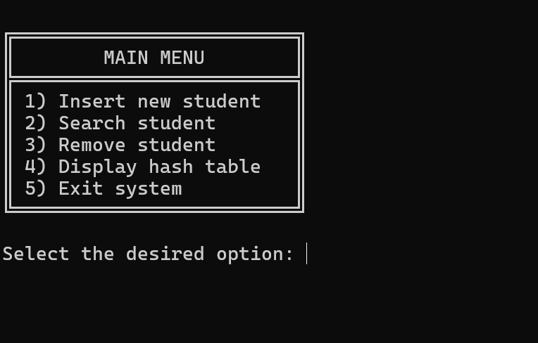
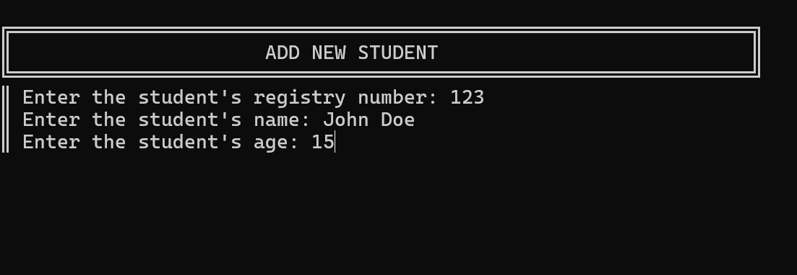
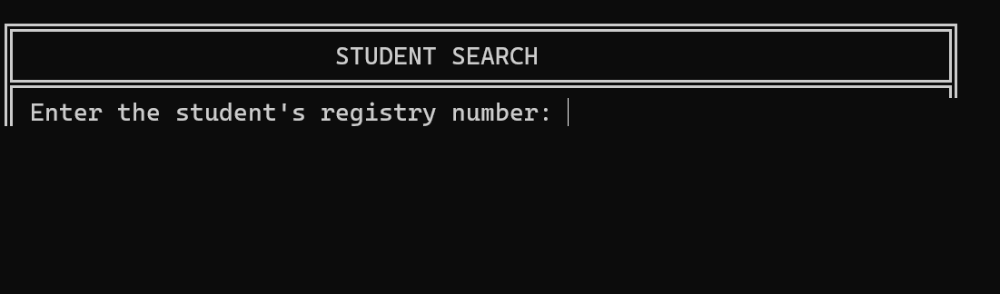
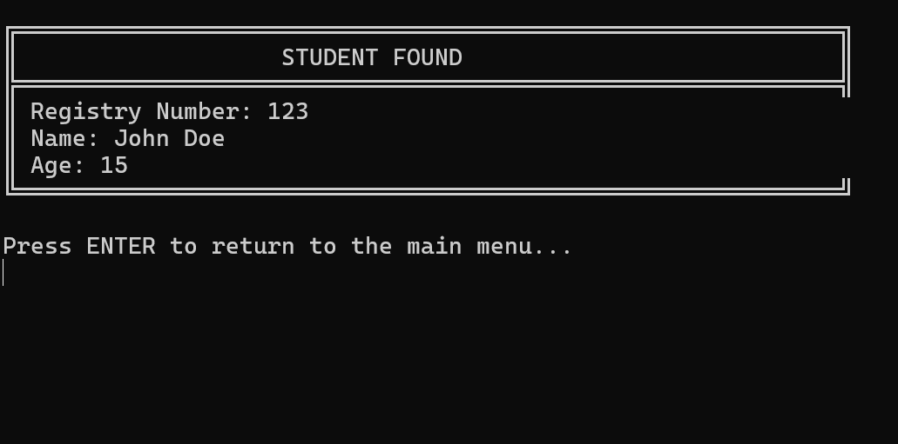
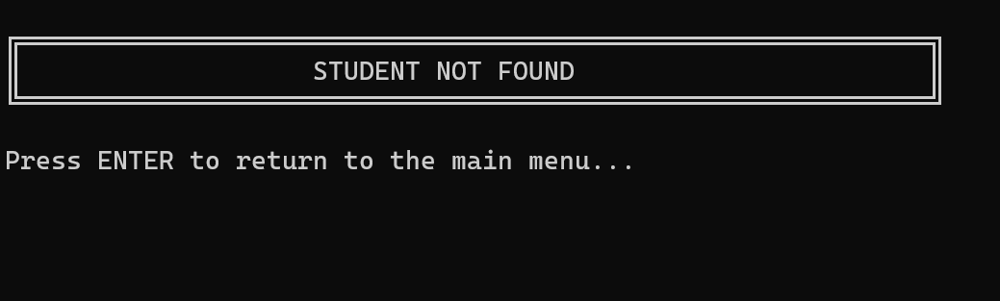
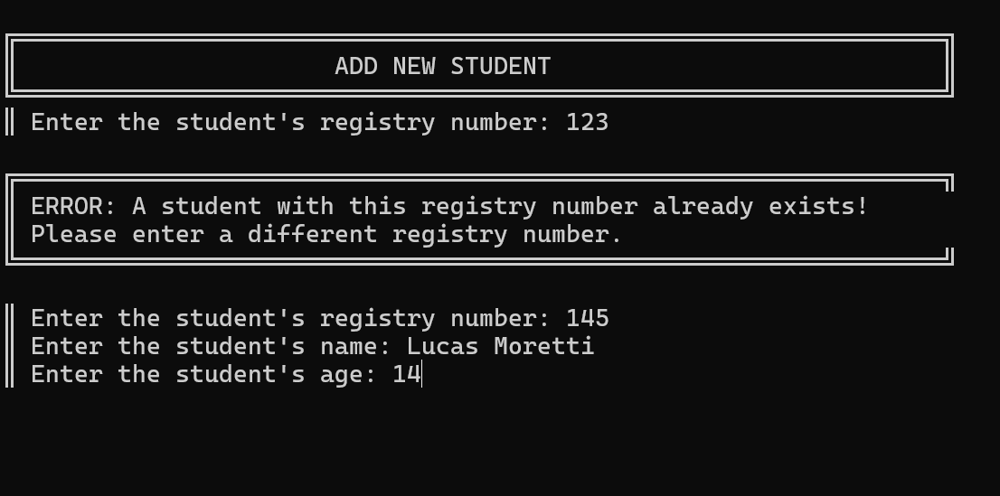
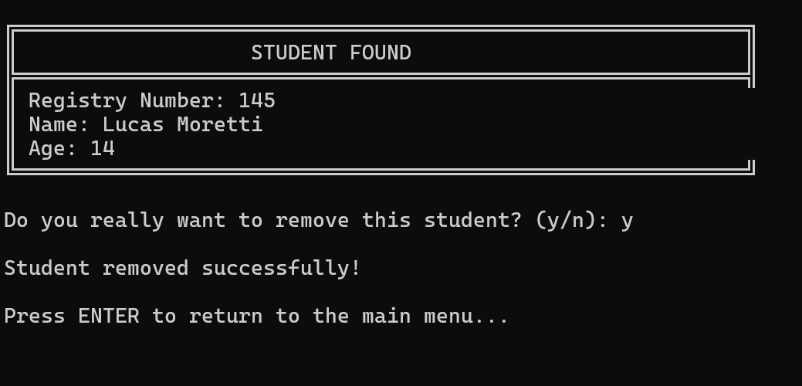
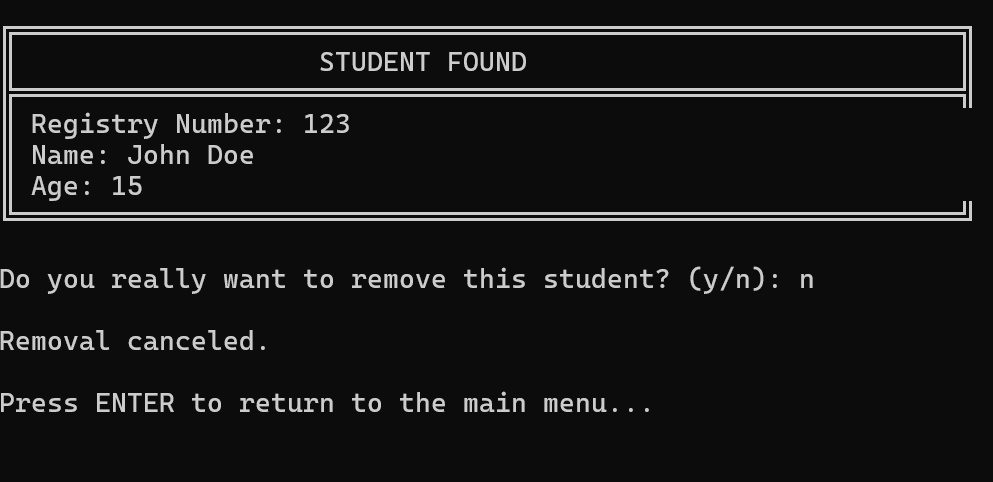
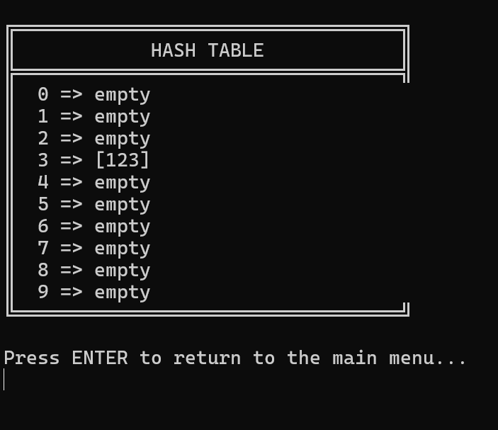

# Custom Java Hash Table

This project consists of a manually implemented hash table in Java, built to deepen my understanding of how hash-based data structures operate internally.

It was developed as the final project for the Data Structures II course — Computer Science, 2025.2.

This is a small student administration system built with the custom hash table above, allowing you to register, search, remove students, and view how the data is organized internally.

<br>

## Table of contents
- [Features](#features)
- [How to run](#how-to-run)
- [Pre-requisites](#pre-requisites)
- [Screenshots](#screenshots)
- [Author](#author)

<br>

## Features
- Insert new student
- Search for student
- Remove student
- Display hash table
- Collision treatment via LinkedList array

<br>

## How to run

### Pre-requisites
- Java [(download)](https://www.java.com/en/download/manual.jsp)

<br>

**1.** Clone the project:
```
git clone https://github.com/beaalmeidas/HashTable-ProjU2-ED2.git
```

**2.** Open a terminal, go to the project's directory, and compile all files:
```
javac -d bin (Get-ChildItem -Recurse -Filter *.java).FullName
```

**3.** Run (from the main menu):
```
java -cp bin src.Main
```

<br>

## Screenshots

|  |  |
| :---: | :---: |
|  |  |
|  |  |
|  |  |
|  |  |

<br>

## Author
Beatriz Almeida de Souza Silva

Nov 2025